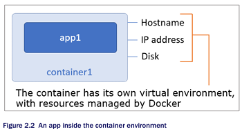
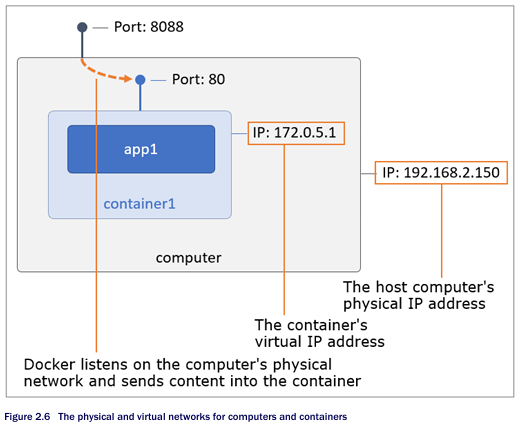

# Hypervisor

Docker (the software platform) on Linux directly manages containers using the host kernel without a hypervisor. Hypervisor is used by the VMs which uses its own OS ro run everything. For Docker, it shares OS, Memory and CPU with the host machine

# Container

1. A box with the application inside it. It has its own details like hostname and IP address
2. They share the memory and cpu of the computer and OS of the host computer unlike VMs which has its own OS on top of the hypervisor
3. Containers fix the issue of isolation and density

# Running a web application

1. The container is running at an allocated IP address at the port 80.
2. The external port 8080 is mapped to the internal port, making it accessible at port 8080

