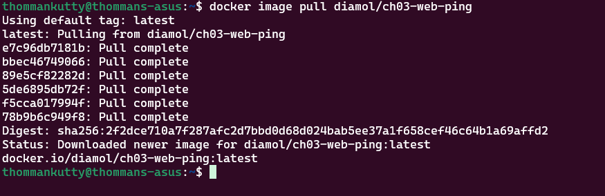
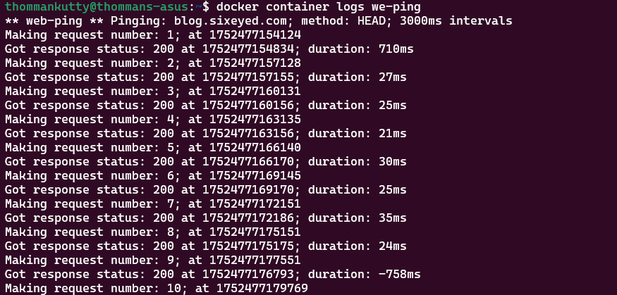
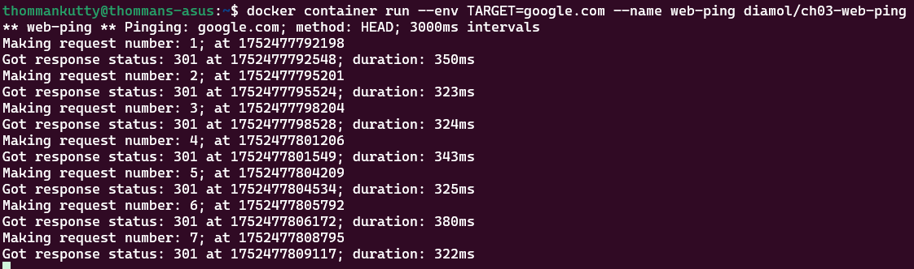

# Using a container image from Docker Hub

Pull down the latest avaialable version of this image from dockerhub and run the application

```bash
# Pull the image
docker image pull diamol/ch03-web-ping

# Run the Application
docker container run -d --name we-ping diamol/ch03-web-ping
```

Pulling images from Dockerhub


App is constantly pinging


## Providing ENV variables

```bash
docker container run --env TARGET=google.com --name web-ping diamol/ch03-web-ping

```

Applications can be packaged with default values but it should be able to override


