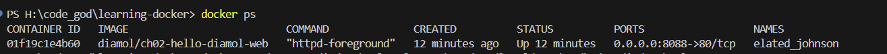
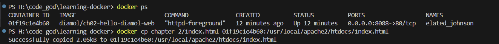
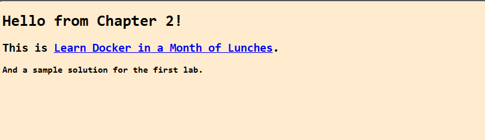

#### Exercise 
your task is to run the website container from this chapter, but replace the index.html file so when you browse to the container you see a different homepage (you can use any content you like). 

Remember that the container has its own filesystem, and in this application the website is serving files which are on the container’s filesystem. 

Here are some hints to get you going: 
- You can run docker container to get a list of all the actions you can perform on a container
- Add `--help` to any docker command and you’ll see more detailed help text 
- In the `diamol/ch02-hello-diamol-web` Docker image, the content from the website is served from the directory `/usr/local/apache2/htdocs` (that’s `C:\usr\local\apache2\htdocs` on Windows).

##### 1. Run the container and note down the container ID 
```bash
docker container run --detach --publish 8088:80 diamol/ch02-hello-diamol-web
```


##### 2. Get the container ID 
```bash
docker ps 
```


##### 3. Replace the index.html file 
```bash
docker cp chapter-2/index.html 01f19c1e4b60:/usr/local/apache2/htdocs/index.html
```


